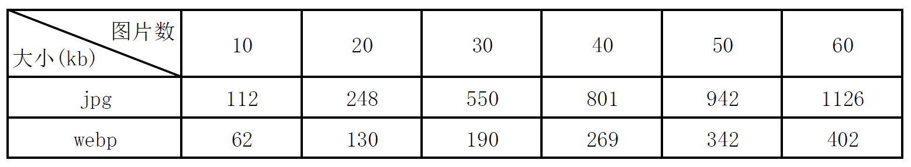
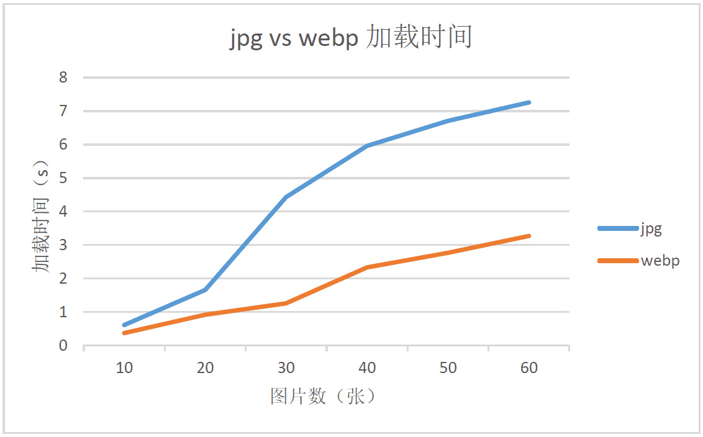

# 性能优化 串讲

## 问题列表

**初始阶段 -> 加载优化**

1. 首页加载慢的优化
2. 优化图片的做法
3. 实现 Webpack 打包优化
4. 实现 CDN 加速

**运行阶段 -> 渲染优化**

1. 渲染十万条数据如何不造成卡顿


## 学习目标

* [x] 理解前端优化中两个分类
* [ ] 了解导致前端性能问题的根本原因
* [ ] 知道一些常用的性能问题的解决方案


## 问题详解

### 初始阶段

#### 1. 首页加载慢的优化

#####问题分析

- 首页加载图片过多
- 首页的请求量过多
- 首页请求的**静态资源**（HTML、CSS、JS、图片...）过大

> 结论：所有加载慢的问题最终都可以归纳成两个问题 **多** 和 **大**。Tips：还有网速不好和电脑太渣


#####问题讲解

模拟面试对话

Q: 面试官爸爸   A: 你


Q：那既然你已经知道了首页加载慢的几个原因，那我先问你**首页加载图片过多怎么处理？**


---

A：**减少**图片不就完了吗


---

Q：那我们的首页就是有这么多图片怎么办？


---

如何分析：看看[淘宝](https://www.taobao.com/)怎么解决


---

A: 可以通过**懒加载**的方式来减少**首屏图片**的加载量


---

Q: 懒加载是什么原理？


---

如何分析：看看[懒加载的库](https://www.andreaverlicchi.eu/lazyload/demos/dynamic_content.html)

```html


<------ 滚动到特定位置的时候 ------>


```


---

A:  懒加载原理就是监听滚动条事件，如果（滚动条距离浏览器顶部的高度 === 图片距离顶部的高度），那么就将 data-src 的值赋值到 src 上。


---

Q: 那假设首页的小图片就是很多，比如有很多个小 ICON 怎么办？


---

如何分析：还是看看[淘宝](https://www.taobao.com/)怎么解决

1. 对于纯色系**小图标**可以使用 [iconfont](https://www.iconfont.cn/help/detail?&helptype=code) 来解决
   - 设置 font-family 的 CSS 属性
2. 对于一些彩色的**小图片**可以使用雪碧图
   - 把所有小图片拼接到一张大图片上
   - 并使用 background-position 的 CSS 属性来修改图片坐标


---

A: 可以分别使用 iconfont 和雪碧图来处理小图标和小图片


---


> 总结：
>
> 首页加载图片过多的问题，可以通过以下几种方法解决：
>
> 1. 通过懒加载的方式处理非首屏的图片
> 2. 对于小图标可以采用 iconfont 的方式解决
> 3. 对于小图片可以采用雪碧图的方式解决


Q: **首页的请求量过多怎么解决？**


---

如何分析：

​	先通过工具来确定是哪些类型的资源请求过多

1. 通过浏览器的 Network 可以确定首页加载的资源和请求量

   - requests：请求数量
   - resources：前端资源总大小

   - DOMContentLoaded： 浏览器已经完全加载了 HTML， 其他静态资源（ JS, CSS, 图片等）并没有下载完毕（能看，不能用）
   - Load：浏览器已经加载了所有的静态资源（能用了）
2. 通过 converge 来查看代码的使用状况
   - 只针对 JS 和 CSS
   - 可以看出哪些代码虽然加载了但是没有执行
   - 没有执行的代码可以考虑一下是否可以懒加载？


---

A:  可以通过**减少**资源的请求量

- 通过 [nginx 服务器](https://tengine.taobao.org/download/nginx@taobao.pdf) （可用来做 CDN，**用来处理静态资源**）来做**资源文件合并** [combo](https://github.com/alibaba/nginx-http-concat) -- **将多个JavaScript、CSS文件合并成一个**
  - 扩展：[日常企业项目](https://www.aliyun.com/product/list)中服务器按照功能区分：
    - **应用服务器**：服务端语言运行的服务器（Java，NodeJS...）放淘宝应用的位置
    - 数据库服务器：放数据库的服务器
    - 存储服务器：放大型文件的服务器（例如各种网盘）
    - **CDN服务器**：**放静态资源**的服务器（JS，CSS, 图片, 字体...）
- 通过打包工具（Webpack）来做资源文件的**物理打包**（相对没有第一种灵活）


Q: 只有通过合并静态资源的方式才能减少资源请求量吗？


---

如何分析：

​	除了从资源层面来解决问题，还可以从我们自己写的代码本身来考虑。

1. 对于引入的一些比较大型的第三方库，比如 组件库（[antd](https://ant.design/docs/react/getting-started-cn#%E6%8C%89%E9%9C%80%E5%8A%A0%E8%BD%BD)，[element-ui](https://element.eleme.cn/#/zh-CN/component/quickstart#an-xu-yin-ru)），函数库（[lodash](https://github.com/lodash/babel-plugin-lodash)）等，**务必设定按需加载**。Tips: 一般都是用 Babel 插件来实现的
  
   

2. 可以通过**前端**路由懒加载的方式（只限于 [SPA 应用](https://preview.pro.ant.design/dashboard/analysis)）

   - 使用 [React lazy](https://zh-hans.reactjs.org/docs/code-splitting.html#reactlazy) 进行动态路由的加载（React 16.6 以上版本才可以使用 React lazy）
   - 演示 React lazy 的使用


---

A: 当然不是，还可以从代码层面的优化，比如说：

 	1. 如果在项目中引入了比较大型的第三方库，那就可以通过特定的 Babel 插件来进行按需加载
 	2. 在路由层面也可以使用 React lazy 进行动态路由的加载，从而可以减少首页的 JS 和 CSS 的大小


---

Q：那我问你为什么 React lazy 可以进行动态路由的加载？


---

如何分析：先看看使用方式

```react
// 1. 引入 react lazy, 并且使用 import 动态导入组件
import { lazy } from 'react'; // 静态导入


lazy(() => import('./Home')); // 动态导入

// 2. 引入 Suspense 组件，并使用 Suspense 将根组件包裹起来，并使用 fallback props 传入 loading 组件
import { Suspense } from 'react';

// 注意：使用 lazy 加载的组件，必须是 Suspense 子组件，或者孙组件
<Suspense fallback={<div>Loading...</div>}>
	<OtherComponent />
</Suspense>
```


动态导入([dynamic import](https://zh-hans.reactjs.org/docs/code-splitting.html#import))：当代码运行 import 的时候，再导入组件

```javascript
import("./math").then(math => {
  console.log(math.add(16, 26));
});

// 类似于 fetch，都是返回一个 Promise

fetch("./math").then(math => {
  console.log(math.add(16, 26));
});
```


演示 Webpack 的代码分割


> 结论：
>
> 1. import('xxx') 返回的是一个 Promise 
>
> 2. Webpack 只要遇到了 import('xxx')，就会把括号里引入的内容单独打一个包


---

A:  首先 React lazy 是使用了 dynamic import 的标准，webpack 只要遇到了 dynamic import， 就会把里面引入的内容单独打一个包。

由于 dynamic import 返回的是一个 Promise，所以可以使用 Promise 的状态来做**渲染的流程控制**。

如果当前 Promise 是 pending 状态，那么就渲染 Loading 组件，如果 Promise 是 resolve 状态那么就渲染动态导入的组件。


---


> 总结：
>
> 首页的请求量过多，可以通过一些手段来**减少**资源的请求量，比如：
>
> 1. 通过 nginx 服务器来做资源文件的合并或者通过 Webpack 等打包工具进行物理打包
> 2. 在代码层面，对于需要引入一些大型第三方库的时候，可以通过特定的 Babel 插件来进行按需加载
> 3. 还有可以使用 React lazy 或其他动态导入方案来进行前端路由层面的动态加载，从而可以减少首页的 JS 和 CSS 的大小


Q: **首页请求的资源（CSS、JS、图片...）过大怎么解决？**


---

A: 把资源变小不就完了吗？


---

Q: 怎么变小？


---

A: 

1. 要分资源文件，CSS，JS，图片等要分开来处理
2. CSS 和 JS 可以通过 Webpack 来进行[混淆和压缩](https://tool.chinaz.com/tools/jscodeconfusion.aspx) （下个题目讲）
   - 混淆：将 JS 代码进行字符串加密（最大层度减少代码，比如将长变量名变成单个字母等等）
   - 压缩：去除注释空行以及 console.log 等调试代码
3. 图片也可以进行压缩（下个题目讲）
   - 可以通过自动化工具来压缩图片
   - 对图片进行转码 -> base64 格式
   - 使用 WebP 格式
4. 通过开启 gzip 进行**全部资源**压缩
   - gzip: 是一种压缩文件格式，可以对任何文件进行压缩（类比于文件压缩）
   - 可以通过 nginx 服务器的配置项进行开启（演示 `/usr/local/etc/nginx`）


---


#####答题思路

> 对于首页加载慢的问题，一般是由于首页加载资源过多，并且资源过大导致。所以应对的策略就减**少**资源的数量以及减**小**资源的大小。
>
> - 对于图片可以懒加载，减小首屏图片加载量。以及对于小图标和小图片和分别使用 iconfont 和 雪碧图来解决，最大程度减少首屏图片数量，从而提升首页渲染性能。
> - 对于其他资源可以通过打包（nginx combo 或者 Webpack 打包）来合并资源，并可以通过懒加载路由的方式来减小首页 JS 的加载量
> - 减小资源的方式可以通过压缩和混淆加密来减小文件体积，图片则可以使用工具来压缩或者使用 webp 格式。
> - 同时可在服务器端开始 gzip 压缩来最大化减少所有文件体积。
>
> 前端中最常见资源：HTML、CSS、JS、图片


####2. 优化图片的做法

##### 问题分析

1. 减**少**图片的请求 -- 可懒加载图片
2. 减**小**图片的大小


##### 问题讲解

Q: 好，那你刚刚说可以使用自动化工具对图片进行压缩，你是使用什么工具？


---

A: 用 熊猫站 不就完了吗？


---

如何分析

​	[熊猫站](https://tinypng.com/)：智能压缩 PNG 和 JPG 的一个网站

1. 可以对图片进行**等比例无损压缩**


---

Q: 那你认为为什么这个工具可以同比例无损压缩？


---

如何分析

​	看看熊猫站的描述

> 通过相似颜色“量化”的技术来减少颜色数量，并且可以将 24 位的 PNG 文件转化成 8位的彩色图片。同时可以将**不必要的元数据**进行剥离。
>
> --> 翻译成人话
>
> **通过减少颜色的数量以及不必要的数据来实现文件压缩**


---

A：通过减少颜色的数量以及不必要的数据来实现文件压缩 


---

Q: 非常 nice，但是这是方式不是有一个问题？难道每当我需要处理图片的时候，就要进入这个网站去上传一下吗？这样不仅仅效率低，还不安全。


---

A: 熊猫站很佛系的，他们把图片压缩工具 [开放](https://tinypng.com/developers/reference/nodejs) 出来了。可以使用 npm 安装开源包，就可以在我们本地进行图片压缩啦。


---

Q: 那除了这个方式还有什么其他的方式来优化图片吗？


---

如何分析

​	对图片进行转码 -> [base64 格式](https://c.runoob.com/front-end/59)


---

A: 可以使用 Webpack 的 [url-loader](https://www.webpackjs.com/loaders/url-loader/) 进行图片策略配置，将**小图**转换成 base64 格式，因为 **base64 格式的图片的作用是减少资源的数量，但是 base64  格式的图片会增大原有图片的体积**


---


A:  还有一种方式就是使用 webp 格式的图片


---

如何分析

​	图片格式有很多种，PNG、JPG、GIF，还有新的 WebP 格式

​	WebP 的优势：

​	根据 Google 的测试，同等条件等比例无损压缩后的 WebP 比 PNG 文件少了 26％ 的体积。并且图片越多，压缩后的体积优势越明显。

**压缩率比较，JPG vs WebP**




**加载时间比较，JPG vs WebP**



[体验一下 WebP](https://www.upyun.com/webp)


---


#####答题思路

> 图片的优化，也是从两个方面来考虑：**太多** 和 **太大**。
>
> - 可以通过懒加载**减少**图片的请求，或者通过雪碧图来合并图片，以及将小图转化成 base64 的格式，来解决多的问题。
>
> - 图片大的问题，可以通过自动化压缩工具来压缩图片，或者使用 WebP 格式的图片。


#### 3. 实现 Webpack 打包优化

#####问题分析

1. 减**少**包数量
2. 减**小**包体积


#####问题讲解

Q: 我问你，怎么使用 Webpack 进行打包优化？


---

A: 少 和 小


---

Q: 怎么样少，怎么样小


---

如何分析

少 -> 使用 Webpack 进行物理打包。

小 -> 使用 Webpack 进行混淆和压缩，所有与 Webpack 优化相关的配置都是在 [optimization](https://webpack.docschina.org/configuration/optimization/) 这个配置项里管理。

> 从 webpack 4 开始，会根据你选择的 [mode](https://webpack.docschina.org/concepts/mode/) 来执行不同的优化，不过所有的优化还是可以手动配置和重写。
>
> development：不混淆，不压缩，不优化
>
> production：混淆 + 压缩，自动内置优化
>
> 结论：只需要将 mode 改成 production 即可


A: 使用 Webpack 对代码进行混淆和压缩，并且可以使用 React lazy 进行拆包，结合路由进行按需加载。


---

Q: 那这里是不是有个问题？既然你对文件进行拆包处理，那么肯定会造成文件变多，是不是有矛盾？


---

如何分析

其实不冲突，因为拆包后的文件，不可能同时加载的，所以就不会造成同一时间资源请求过多的请求。

**但是要注意打包策略**

我们通常会把包，分为两类

第三方包（node_modules 里面的）

自己实现的代码（src 目录里面的）

	- 公共的
	- 非公共的


所以我们可以把第三方包打一个包，公共的代码打一个包，非公共的代码打一个包。

第三方包：改动频率 -- 小

公共代码包：改动频率 -- 中

非公共代码包：改动频率 -- 高


所以可以将 **打包策略** 结合 **网络缓存** 来做优化

对于不需要经常变动的资源（第三方包），可以使用 `Cache-Control: max-age=31536000`（缓存一年） 并配合协商缓存 `ETag` 使用（一旦文件名变动才会下载新的文件）

对于需要频繁变动的资源（代码包），可以使用 `Cache-Control: no-cache` 并配合 `ETag` 使用，表示该资源已被缓存，但是每次都会发送请求询问资源是否更新。


---

A: 其实不冲突，因为拆包后的文件，不可能同时加载的，所以就不会造成同一时间资源请求过多的请求。但是可以使用 Webpack 的 optimization.splitChunks 进行**打包策略的优化**。将 node_modules 单独打包，以及将自己实现的代码也可以分为公共包和非公共包，并且分开打包。

最后还可以结合**网络缓存**来做加载性能优化。


---


#####答题思路

>Webpack 打包优化，也是从两个方面来考虑：**太多** 和 **太大**。
>
>- 可以通过设置 mode = production 来默认实现 Webpack 对代码的混淆和压缩，从而最大程度的减少代码体积
>- 使用 Webpack + dynamic import 并结合路由的入口文件做拆包处理。
>- 并且可以设定一些打包策略，并配合网络缓存做最终的加载性能优化。


####4. 实现 CDN 加速

##### 问题分析

1. 什么叫做 CDN（内容分发网络）
   - **放静态资源**的服务器（JS，CSS, 图片, 字体...）
2. 为什么 CDN 可以实现加速


##### 问题讲解

​	为什么 CDN( 解决方案 -> nginx ) 可以实现加速

 


游戏分区：北京一区，上海一区，广东一区......


Tips：CDN 服务器就是在你家门口放一台服务器，把所有的静态资源都同步到你家门口这台服务器上，以后只要你访问这个网站，都直接从这台服务器上下载静态资源。


Http1.1 请求：**对于同一个协议、域名、端口，浏览器允许同时打开最多 6个 TCP 连接（最多同时发送 6个请求）**

```javascript
主站     Request URL: https://www.taobao.com/

JS&CSS  Request URL: https://g.alicdn.com/??kg/home-2017/1.4.17/lib/style/lazy.css

图片     Request URL: https://img.alicdn.com/tfs/TB1_uT8a5ERMeJjSspiXXbZLFXa-143-59.png

字体     Request URL: https://at.alicdn.com/t/font_403341_n8tj33yn5peng66r.woff
```


扩展：[Http2.0](https://http2.akamai.com/demo)： 引入了**多路复用**的机制，可以最大化发送请求数量。


##### 答题思路

> CDN 服务器主要是用来放静态资源的服务器，可以用来**加速**静态资源的下载
>
> CDN 之所以能够加速，是因为会在很多地方都部署 CDN 服务器，如果用户需要下载静态资源，会自动选择最近的节点下载
>
> 同时由于 CDN 服务器的地址一般都跟主服务器的地址不同，所以可以破除浏览器对同一个域名发送请求的限制


### 运行阶段

####1. 渲染十万条数据如何不造成卡顿

##### 问题分析

1. 为什么渲染很多条数据会造成浏览器卡顿

 	2. 怎么优化长列表的情况


##### 问题讲解

1. 为什么渲染很多条数据会造成浏览器卡顿

   

> 结论：
>
> 1. 无论是浏览器中的 DOM 和 BOM，还是 NodeJS，它们都是基于 JavaScript 引擎之上开发出来的
> 2. DOM 和 BOM 的处理最终都是要被转换成 JavaScript 引擎能够处理的数据
> 3. 这个转换的过程很耗时
> 4. **所以在浏览器中最消耗性能的就是操作 DOM**


2. 怎么优化渲染很多数据的情况

**指导原则：尽可能的减少 DOM 的操作**


eg：假如有一个需求，我们要在一个页面中 ul 标签里渲染 **十万** 个 li 标签。


```javascript
// 插入十万条数据
const total = 100000;
let ul = document.querySelector('ul'); // 拿到 ul

// 懒加载的思路 -- 分段渲染
// 1. 一次渲染一屏的量
const once = 20;
// 2. 全部渲染完需要多少次，循环的时候要用
const loopCount = total / once;
// 3. 已经渲染了多少次
let countHasRender = 0;

function add() {
  // 创建虚拟节点，（使用 createDocumentFragment 不会触发渲染）
  const fragment = document.createDocumentFragment();
  // 循环 20 次
  for (let i = 0; i < once; i++) {
    const li = document.createElement('li');
    li.innerText = Math.floor(Math.random() * total);
    fragment.appendChild(li);
  }
  // 最后把虚拟节点 append 到 ul 上
  ul.appendChild(fragment);
  // 4. 已渲染的次数 + 1
  countHasRender += 1;
  loop();
}

// 最重要的部分来了
function loop() {
  // 5. 如果还没渲染完，那么就使用 requestAnimationFrame 来继续渲染
  if (countHasRender < loopCount) {
    // requestAnimationFrame 叫做逐帧渲染
    // 类似于 setTimeout(add, 16);
    // 帧：一秒钟播放多少张图片，一秒钟播放的图片越多，动画就约流畅
    // 1000/60 = 16
    window.requestAnimationFrame(add);
  }
}
loop();
```


> 结论：
>
> 1. 可以使用 document.createDocumentFragment 创建虚拟节点，从而避免引起没有必要的渲染
> 2. 当所有的 li 都创建完毕后，一次性把虚拟节点里的 li 标签全部渲染出来
> 3. 可以采取分段渲染的方式，比如一次只渲染一屏的数据
> 4. 最后使用 **window.requestAnimationFrame** 来逐帧渲染


##### 答题思路

> 导致浏览器卡顿的原因一般都是**操作 DOM** 的次数太频繁。
>
> 如果想要渲染很多条数据不造成卡顿，那么就一定要尽可能的减少操作 DOM 的次数。
>
> 比方说 React 的虚拟 DOM，本质上就是用 JS 数据来模拟真实 DOM树，从而大大减少了操作真是 DOM 的次数。
>
> 还有在渲染的时候，可以使用 document.createDocumentFragment 创建虚拟节点，从而避免引起没有必要的渲染
>
> 也可以采取分段渲染的方式，最后使用 window.requestAnimationFrame 来**逐帧渲染**


#### 课程总结

> 记住：
>
> 在前端中性能优化的点主要分为两个阶段：
>
> 1. 初始阶段，主要就是加载方面优化的问题。所有问题的指导原则就两点：
>    - 尽可能的**减少**前端资源的数量
>    - 尽可能的**减小**前端资源的大小
>
> 2. 运行阶段，主要就是渲染方面优化的问题。只要是在浏览器中，所有的问题的指导原则就是：
>    - 尽可能的减少操作 DOM

