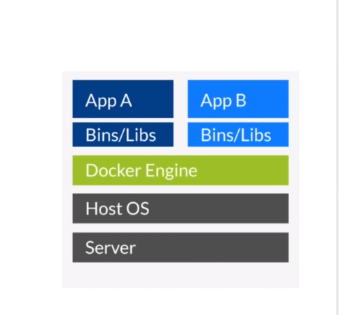

## Deploy

### docker使用



> 常用命令

1. docker images: 查看所有image;
2. docker run -p 8080:80 -d image;
``说明:`` image 80端口映射到本地8080的端口, -d 允许程序直接返回;
3. docker ps: 当前运行的container、 -a 查看所有的container;

** 在host和container之间拷贝文件 **

4. docker cp index.html container://usr/share/nginx/html
5. docker stop container 停止docker
6. docker rm id: 删掉docker实例
7. docker rmi image: 删除image
8. docker pull 获取image
9. docker build -t container:tag 创建image
10. docker run 运行container
11. docker exec -it 775c7c9ee1e1 /bin/base 进入容器
12. docker rm $(docker ps -qf status=exited) 删除exited
13. 

> Dockerfile

``作用``: 通过Dockerfile创建docker镜像;

- example

1. 
```Dockerfile
 From alpine:latest
 MAINTAINER andyxu
 CMD echo 'hello docker'
```
docker build -t (tag) hello_docker .
.代表这个路径所有内容

2. 
```Dockerfile
  FROM ubuntu
  MAINTAINER xbf
  RUN sed -i 's/archive.ubuntu.com/mirrros.ustc.edu.cn/g' /etc/apt/sources.list
  RUN apt-get update
  RUN apt-get install -y nginx
  COPY index.html /var/www/html
  ENTRYPOINT ["/usr/sbin/nginx", "-g", "Daemon off;"]
  EXPOSE 80
```
```
FROM base image
RUN 执行命令
ADD 添加文件
CMD 执行命令
EXPOST 暴露端口
WORKDIR 指定路径
MAINTAINER 维护者
ENV 设定环境变量
ENTRYPOINT 容器入口
USER 指定用户
VOLUMNE mount point
```

- curl测试: curl http://localhost

> todo

### Registey 仓库


### daemon 守护程序


### client 客户端

### container 容器入口

### host 宿主机

### compose 多容器app - docker-compose
